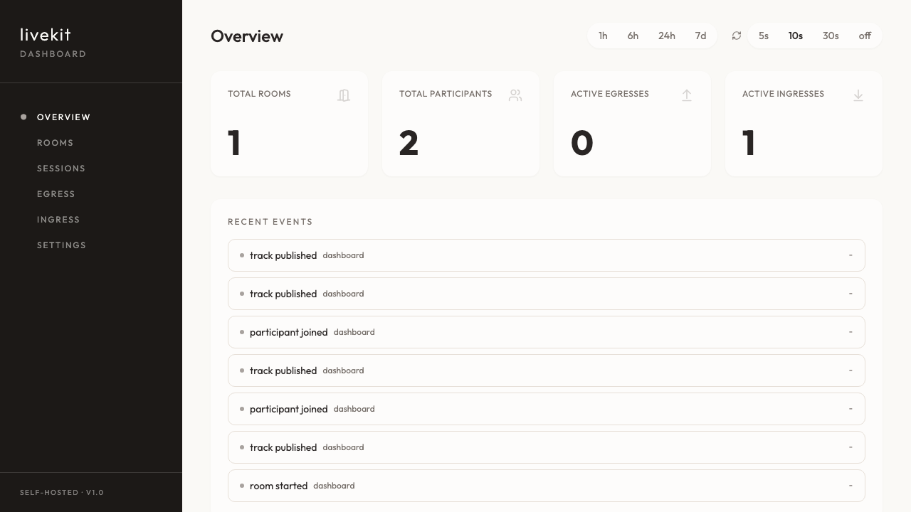

# LiveKit Dashboard

Self-hostable dashboard for monitoring a self hosted LiveKit instances.



## What you get

- Overview metrics (rooms, participants, active egress/ingress)
- Rooms list + room detail (participants and tracks)
- Sessions history (webhook-backed)
- Egress and ingress pages
- Settings page with connection info

## Environment variables

- `LIVEKIT_URL` (required)
- `LIVEKIT_API_KEY` (required)
- `LIVEKIT_API_SECRET` (required)
- `PORT` (optional, default: `3000`)
- `FRONTEND_DIR` (optional, default: `./frontend/dist`)
- `SQLITE_PATH` (optional, default: `./data/dashboard.db`)

## Local development

1. Install frontend dependencies:

```bash
cd frontend
npm install
```

2. Build frontend:

```bash
npm run build
```

3. Start backend from repo root:

```bash
LIVEKIT_URL=http://localhost:7880 \
LIVEKIT_API_KEY=devkey \
LIVEKIT_API_SECRET=secret \
cargo run
```
